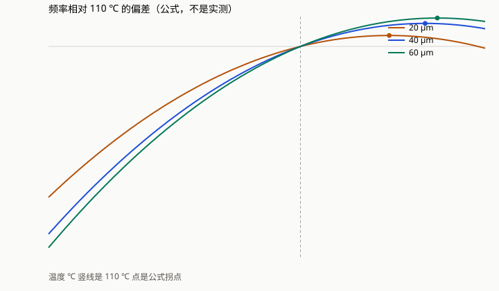

# 片内恒温谐振器三路线对照

赛题 5：AI+学科交叉。本文件按赛题页面公布的技术方案大纲写成，用作作品方案正文。提交系统要求另存 PDF，文件不超过 10 MB。官方空白模板见百度网盘（提取码 2026）：https://pan.baidu.com/s/1Ar9fYa25nI8yimHqi5o3hg?pwd=2026 。模板若有封面栏，八节正文贴入模板。封面、视频、答辩 PPT 和本文件都不写学校名称、校徽、指导教师。队员姓名和团队编号在报名系统填写。

同目录 `技术方案.pdf` 由本文件导出。两份不一致时，以本文件为准，重新导出 PDF。

## 报名栏

| 栏目 | 内容 |
| --- | --- |
| 作品名称 | 片内恒温谐振器三路线对照 |
| 名称长度 | 12 字，不超过 20 字 |
| 赛题 | 赛题 5：AI+学科交叉 |
| 作品方案 | 本文件 |

## 作品简介

问题：环境−40℃到105℃再返回，硅微谐振器频率会漂。只改厚度、只加热、一起做，缺同预算对照。方案：沿用已发表片内加热谐振器，硅厚20、40、60μm，设定110℃。闭式公式与一阶热路，等次数搜索PI，日志出表。效果：不加热20μm为1361.5168 ppm、能耗0。加热两路均为20μm、0.039 W、0.181秒，偏差2.853381e-4与2.485053e-4 ppm，能耗1.487023 J。闭式拐点162.88、184.26、191.54℃，文献有限元89、112、138℃，差未拟合。应用：公式仿真，python3 -m plan_b_sim可复现。文献ppb与流片不计入本队。

上段 300 字，按「问题—方案—效果—应用」书写。表中的完整数字在第六节，与 `plan_b_sim/output/effect_table.md` 一致。

## （一）项目概述

### 1. 背景与意义

计时和传感器里常用一块很小的硅结构，它以某一频率振动。环境变冷或变热，硅的刚度跟着变，振动频率就漂。把频率少漂一些，文献里已经有两条路：改变硅的厚度，让频率对温度的曲线在某个温度附近变平；或者在芯片上做加热器，把器件加热到一个固定温度。

本方案锁住的器件来自学位论文《微腔恒温微机械谐振器精密测温及其频率稳定性研究》第二章，英文题名 Precise Temperature Measurement and Frequency Stability of Micro-oven-controlled Micromechanical Resonator。那是一颗压电宽度伸张谐振器，加上片内折叠梁加热腔。宽度 143 μm。叠层按厚度加权，加权与叠放顺序无关：掺钪氮化铝 1 μm，硅，钼 0.15 μm，氧化硅 0.2 μm。硅为磷掺杂约 1.0×10²⁰ cm⁻³，晶向 ⟨100⟩。硅厚度只有三档：20、40、60 μm。加热器只会加热，功率不能为负。本方案把器件希望停住的温度定为 110 ℃。环境温度从 −40 ℃ 走到 105 ℃，再走回来。

该学位论文已经报告过这颗器件的有限元拐点、实测拐点、恒温后的频率偏差、品质因数和流片。那些结果属于该学位论文。本方案第六节不把它们写进本队的效果表。附录只说明引用边界，不把那些数字再抄一遍。

仓库里另有一套圆环谐振器的宽度傅里叶代理模型和与之配套的神经网络。那套数据是单一温度下的频率和品质因数，没有频率随温度的曲线，不参加本方案，也不进入效果表。

本方案要留下的记录是：在同一条环境曲线、同一种控制器、相同的模型调用次数下，只改厚度、只加热、两件事一起做，三行日志各是多少。闭式公式若与学位论文的有限元拐点对不上，差留在日志里。公式不改符号，也不乘系数去凑那三个温度。

### 2. 核心目标

1. 用学位论文式 (2-1) 至 (2-9) 算出三档厚度的频率–温度曲线，读出频率对温度的导数过零的温度。
2. 把闭式过零与学位论文有限元约 89 ℃、112 ℃、138 ℃ 的差写入日志。
3. 用同一条环境曲线和同一种速度式比例积分控制器跑完三条路线，三行模型调用次数相等。
4. 效果表由程序从日志生成。人核对过零是不是局部极大，以及加热功率有没有超出上限。
5. 另一台安装了相同 NumPy 的计算机，在仓库根目录执行 `python3 -m plan_b_sim`，表中数字不变。

大模型在本方案里的工作是写出这段程序和本报告。谐振器的宽度、厚度、掺杂和加热结构不由大模型设计，控制器增益也不由大模型挑选，挑选规则写在程序里。

本方案不新做芯片，不做温箱实测。

## （二）需求分析

### 1. 学科专业界定

学科是电子科学与技术中的微机电系统。使用环节是科研仿真：在已发表器件上，把「改厚度」和「片内加热」放进同一次可复现的计算，服务的是谐振器频率随温度变化这一学科问题。赛题页面把工科仿真设计的智能辅助列在作品范围里。本方案对应的是这一类，不是教学系统和临床系统。

### 2. 核心痛点

四件事会使对照失效。

第一，拐点来自一次仿真，加热功耗来自另一次仿真或另一个样品，两列数字不能直接相减。

第二，控制器多搜几组，调用次数就变多。若次数不同，读表的人分不清是路线不同，还是算得更多。

第三，闭式公式和有限元对不上时，若改弹性常数的符号或乘一个系数去贴有限元，表会靠近文献曲线，但用的已经不是公开发表的那组常数。

第四，把学位论文里的 ppb、品质因数或流片结果填进自己的效果表，引用边界就没了。赛题规则要求引用他人技术和数据时标明出处，并禁止伪造。

### 3. AI 赋能需求

程序做三件事。频率公式和热路每次求值都计数，当成预算有限的模型。增益、功率上限和厚度在写死的网格里搜索。排序规则写死，表从日志写出，不手填。

这里没有训练神经网络。决策变量只有三档厚度和一组控制器数，每次评价是闭式公式加上 72 秒的一阶热路。网格搜索在数分钟内可以跑完。再套一个网络，不会多出一次本队实测，也不会改变「常数来自公开公式」这一条。圆环代理模型的网络因此不接入本方案。

大模型不进入这条调用链。

## （三）解决方案设计

### 1. 系统架构

数据层存放弹性常数、热膨胀系数、热阻、热时间常数、环境曲线和搜索网格。弹性常数来自该学位论文的温度公式。热阻和热时间常数用该学位论文对 40 μm 器件公布的 COMSOL 结果。

算法层做四件事：按温度求频率；热路按步积分；速度式比例积分，并把功率限制在 0 和功率上限之间；三条路线按同一调用次数排序。

应用层是三条路线：只做被动，只做主动，一起做。

展示层是一次运行写出的文件：`plan_b_sim/output/effect_table.md`、`effect_table.csv`、`summary.json`、`frequency_ppm.svg`、`frequency_curve.csv`、`winner_traces.csv`。

```
公开常数、环境曲线、三档厚度、控制器网格
                 |
                 v
     频率闭式公式 ----+
                     +--> 每求一次频率或每积分一步热路，计数加 1
     一阶热路与速度式 PI --+
                 |
                 v
     三条路线都停在相同的调用次数
                 |
                 v
     日志生成效果表、频率曲线、中选轨迹
```

### 2. 技术选型依据

频率用学位论文式 (2-1) 至 (2-9)，再加上热膨胀。不对有限元拐点做拟合。

热路用一阶模型：

C dT/dt = P − (T − T环境) / Rth

热阻取 3.85 ℃/mW，也就是 3850 K/W。热时间常数取 37 ms。二者都是该学位论文对 40 μm 器件、从 −40 ℃ 加热到 110 ℃ 的 COMSOL 公布值。三档厚度共用这一组热参数。厚度只进入频率。程序里没有另写一套热阻随厚度变化的公式。

热容 C = 0.037 / 3850 = 9.61038961038961×10⁻⁶ J/K。

控制器只有一种，主动和一起做共用：速度式比例积分。功率状态本身被夹在 0 和功率上限之间，饱和之后积分不会继续堆积。位置式在 1 ms 步长上容易在 0 和功率上限之间来回打满，所以不用。

搜索规模按调用次数对齐，不按「把网格尽量加密」对齐。主动路线是 15 个比例增益 × 16 个积分增益 × 8 个功率上限 = 1920，厚度固定 20 μm。比例增益从 1×10⁻⁵ 到 3×10⁻² W/℃ 按几何级数取 15 个，积分增益从 1×10⁻² 到 30 W/(℃·s) 按几何级数取 16 个。功率上限为 0.02、0.03、0.035、0.039、0.042、0.05、0.08、0.12 W。一起做是 10 个比例增益 × 8 个积分增益 × 同样 8 个功率上限 × 3 个厚度 = 1920。被动只有 3 个厚度，每档重复 640 次不加热轨迹，凑满 1920 条。

本方案不使用 COMSOL、Elmer、CalculiX，不使用圆环代理模型，不训练新的网络，不做双极性制冷，也不新做芯片。

### 3. 核心技术模块

#### 频率模块

频率

f = (1 / (2W)) × sqrt(Eeff / ρeff)

W = 143 μm。等效模量和等效密度按各层厚度加权。硅的 ⟨100⟩ 杨氏模量

E = c11 − 2 c12² / (c11 + c12)

弹性常数随温度写成

c(T) = c0 × [1 + a × 10⁻⁶ × (T − 25) + b × 10⁻⁹ × (T − 25)²]

这里的 10⁻⁶ 和 10⁻⁹ 是弹性常数一次项、二次项的数量级。二次项的单位名称是 ppb，指的是弹性模量公式里的系数，不是本队测到的频率稳定度。

硅的一次项和二次项都取减号，数值按学位论文式 (2-4)：c11 为 159.33 GPa、−27.86、−56.55；c12 为 65.09、−130.38、−12.67。25 ℃ 时由此算出的 ⟨100⟩ 杨氏模量约为 121.573 GPa。掺钪氮化铝按式 (2-5) 取减号，c11 的室温项是 410.06 GPa。钼按式 (2-6) 取减号：329 GPa、−117、−24.9。氧化硅按式 (2-7) 取加号：70 GPa、+204、+221。面内热膨胀按刚度加权。各层厚度按该层自己的线膨胀变化，密度按该层体积变化。

密度：掺钪氮化铝 3244、硅 2330、钼 10200、氧化硅 2200 kg/m³。线膨胀系数：4.9、2.84、4.8、0.55 ppm/K。

符号没有翻转，系数没有重乘。学位论文表 2-1 的室温弹性常数和式 (2-5) 的室温项不一致。频率模块用的是式 (2-5) 的室温项，没有用表 2-1 覆盖，也没有换用别的文献里的氮化铝常数去凑拐点。

25 ℃ 时本公式的频率：20 μm 为 25.996 MHz，40 μm 为 25.649 MHz，60 μm 为 25.523 MHz。厚度越大，频率越低。110 ℃ 时的频率：20 μm 为 26.011210 MHz，40 μm 为 25.667916 MHz，60 μm 为 25.544137 MHz。未四舍五入的值在 `summary.json` 的 `frequency_check`。

拐点是 df/dT 在 −40 ℃ 到 280 ℃ 之间的第一个过零，再用二分收紧。这条公式里三个过零都是局部极大，都高于 150 ℃，并且都离学位论文有限元 40 ℃ 以上。单元测试把这三条锁住，避免以后有人把公式改到贴上有限元。

| 硅厚度 | 闭式过零 | 相对 110 ℃ | 110 ℃ 处斜率 | 学位论文有限元 | 差 |
| --- | ---: | ---: | ---: | ---: | ---: |
| 20 μm | 162.88 ℃ | +52.88 ℃ | 3.74 ppm/℃ | 89 ℃ | +73.88 ℃ |
| 40 μm | 184.26 ℃ | +74.26 ℃ | 5.60 ppm/℃ | 112 ℃ | +72.26 ℃ |
| 60 μm | 191.54 ℃ | +81.54 ℃ | 6.29 ppm/℃ | 138 ℃ | +53.54 ℃ |

越厚，过零越高。这一点与有限元的顺序相同。绝对值高了几十度。差写在 `gap_vs_thesis_fem_c`：+73.8809 ℃、+72.2628 ℃、+53.5350 ℃。更细的斜率是 3.7449、5.6019、6.2900 ppm/℃。第六节沿用日志打印的四位温度和两位斜率。

#### 热路模块

环境在一步之内按直线变化、功率在一步之内不变时，热路这一步有解析解。功率先被夹到 [0, Pmax]，再送进热路。

环境停在 −40 ℃、器件维持在 110 ℃ 时，稳态功率 = 150 / 3850 = 0.03896103896103896 W。这个数用来核对积分器，不填进效果表的能耗列。

若器件温度从一开始就停在 110 ℃，沿本方案环境曲线把功率取成 max(0, (110 − T环境) / Rth)，加热积分是 1.4870129870132085 J。日志打印为 1.487013 J。

#### 环境、控制器和计数

步长 1 ms。前 2 秒环境停在 −40 ℃。然后 30 秒升到 105 ℃，停 5 秒，30 秒降回 −40 ℃，再停 5 秒。总长 72 秒，72000 步。

速度式比例积分：误差 e = 110 − T。功率增量 = Kp × (e − e上一步) + Ki × e × dt。功率再夹到 [0, Pmax]。

停稳时间是器件温度进入 110±1 ℃ 并且之后不再离开的那一步的结束时刻。到结束仍在带外，记为未停稳。被动路线这一格固定写「不加热」。

剩余频率偏差只看环境离开 −40 ℃ 之后，也就是 2 秒以后：|f(T) − f(110)| / f(110) 的最大值，单位 ppm。前 2 秒计入停稳时间，不计入这个 ppm。

一次模型调用是频率公式求值一次，或热路积分一步。搜索阶段用 0.02 ℃ 步长的频率表做插值，插值不再另计。每条路线公布的那一行用频率公式重算，不用插值。

三行调用次数都是 140159293。其中频率求值 983293 次，热路步进 139176000 次。

#### 排序

剩余频率偏差先按 0.0001 ppm 分档，档号是 floor(ppm / 0.0001)。同一档里先比加热能耗，再比拐点离 110 ℃ 的绝对距离，再比停稳时间，再比功率上限、Kp、Ki 和厚度。每条路线先留 12 个候选用公式重算，再排一次，取第一名作为公布行。

因此公布行是这一套规则下的第一名。它不一定是网格里剩余频率偏差的绝对最小值。主动路线的重算候选里有一条偏差 0.000242409 ppm，能耗高于公布行，所以不作为公布行。该条记在 `summary.json` 的主动路线 `finalists` 里。

#### 三条路线允许动什么

| 路线 | 允许动 | 不许动 |
| --- | --- | --- |
| 只做被动 | 硅厚度三档 | 加热功率固定为 0 |
| 只做主动 | Kp、Ki、功率上限 | 厚度固定 20 μm |
| 一起做 | 三档厚度，以及同一套 Kp、Ki、功率上限 | 不引入第三种器件，不改变控制器形式 |

## （四）方案可行性

### 1. 技术可行性

命令已经跑完。被动、主动、一起做的搜索阶段用时 44.6 秒、45.3 秒、44.4 秒，记在 `summary.json` 的 `search_seconds`。依赖是 Python 3 和 NumPy。本环境的 NumPy 版本是 2.4.4。不使用 GPU，不使用 COMSOL。

单元测试：

```bash
python3 -m unittest plan_b_sim.tests.test_model
```

测试锁定 25 ℃ 的硅模量、频率随厚度下降、过零为局部极大且高于 150 ℃、与 89/112/138 ℃ 的距离大于 40 ℃、稳态功率等于温差除以热阻、被动能耗为 0、效果表由日志生成。

落地边界也写在程序里。热阻不随厚度改变。闭式过零比有限元高几十度，而且是局部极大。第六节加热路线的 ppm 很小，是因为温度被拉到 110 ℃ 附近：20 μm 在 110 ℃ 的斜率仍有 3.74 ppm/℃，主动路线的来回偏差 2.853381×10⁻⁴ ppm 除以这个斜率，约 7.6×10⁻⁵ ℃，与日志里的温度残差同一量级。这个 ppm 不是「器件已经工作在拐点上」，也不是温箱里测到的频率稳定度。

### 2. 经济可行性

软件是 NumPy。一次完整对照在 4 核 CPU 上为数分钟，搜索阶段每条路线约 45 秒。不租 GPU，不购买有限元许可，不流片。之后若改网格或改常数，必须重跑 `python3 -m plan_b_sim`，让表重新从日志生成。手改表中的数字，就和程序不一致。

### 3. 推广价值

另一组人安装相同的 NumPy，在仓库根目录执行 `python3 -m plan_b_sim`，得到同一张表。复用条件是这颗已发表谐振器的公开常数还适用。换成别的宽度、掺杂或叠层，要改 `plan_b_sim/model.py` 里的常数，并重新把新公式与有限元或实测的差写入日志。

本方案没有院校试点，也没有企业试用。可以复用的是这条计算流程，不是一条已经装进产品的器件。

## （五）项目实施

### 1. 实施计划

计算部分已经完成：频率公式、热路、等预算搜索、效果表、频率曲线、中选轨迹、单元测试。日志在 `plan_b_sim/output/`。

提交前仍由参赛队完成，本文件不代替这些材料：

1. 同目录已有 `技术方案.pdf`，由本文件导出，小于 10 MB。改了正文就要重新导出。使用官方模板时，把八节贴入模板，封面不填学校和指导教师。
2. 在报名系统填写作品名称、上面那一则不超过 300 字的简介、队员姓名和团队编号。
3. 演示视频为 MP4，时长 3–5 分钟，300 MB 以内。画面放三条路线各自允许改什么、运行命令、第六节的表，以及闭式拐点与有限元的差。
4. 答辩 PPT 另存为 PDF。
5. 代码目录上传网盘。文件夹命名按规则：团队编号-赛题名称-作品名称。分享设为永久有效。网盘里的文件名同样带上团队编号、赛题名称和作品名称。

校赛由学校在 2026 年 10 月 10 日前完成。省赛报名截止 2026 年 10 月 15 日 20:00。

### 2. 资源保障

已用的计算资源是一台 4 核 CPU。程序只依赖 NumPy 数组，不调用 GPU。没有 COMSOL 许可支出，没有流片费用。日志和代码都在本仓库的 `plan_b_sim/`。

### 3. 团队协作

本文件不写队员姓名、学校名称和指导教师。建议三人分工，姓名只在报名系统填写。

- 一人对照学位论文式 (2-1) 至 (2-9) 和 `model.py`，确认弹性常数的符号没有被改去贴有限元。
- 一人执行单元测试和 `python3 -m plan_b_sim`，保管 `output/`。
- 一人导出 PDF、视频和 PPT，并检查全部材料没有学校名称、校徽和指导教师。

效果表只从日志复制。三人看到的是同一份 `effect_table.md`。

## （六）应用效果

### 1. 应用效果预期

这条公式在跑之前，可以预期三件事。不加热时，器件温度等于环境温度，来回频率偏差由冷端 −40 ℃ 决定；三档里 20 μm 离 110 ℃ 最近，斜率也最小，偏差应最小。加热且功率上限不低于稳态功率 0.038961 W 时，器件温度进入 110±1 ℃，来回偏差落到「斜率乘残余温差」的量级，能耗接近从一开始就停在 110 ℃ 的积分 1.487013 J。一起做若仍选 20 μm，说明在这三档里，加厚没有把闭式拐点移到 110 ℃，110 ℃ 处更厚的斜率更大。

下面的表是这次运行的结果。

### 2. 成果展示

下面整段复制自 `plan_b_sim/output/effect_table.md`。这是本队本次公式仿真的效果表。

| 路线 | 拐点误差 ℃ | 剩余频率偏差 ppm | 加热能耗 J | 停稳时间 | 模型调用次数 |
| --- | ---: | ---: | ---: | ---: | ---: |
| 只做被动，硅 20 μm | +52.88 | 1361.5168 | 0 | 不加热 | 140159293 |
| 只做主动，硅 20 μm | +52.88 | 2.853381e-04 | 1.487023 | 0.181 | 140159293 |
| 一起做，硅 20 μm | +52.88 | 2.485053e-04 | 1.487023 | 0.181 | 140159293 |

## 这张表怎么读

拐点误差是频率对温度的导数过零的温度减去 110 ℃。这条闭式公式的过零是局部极大。
- 硅 20 μm：过零 162.88 ℃，论文有限元 89 ℃，差 +73.88 ℃，110 ℃ 处斜率 3.74 ppm/℃。
- 硅 40 μm：过零 184.26 ℃，论文有限元 112 ℃，差 +72.26 ℃，110 ℃ 处斜率 5.60 ppm/℃。
- 硅 60 μm：过零 191.54 ℃，论文有限元 138 ℃，差 +53.54 ℃，110 ℃ 处斜率 6.29 ppm/℃。
差留在 `summary.json` 的 `gap_vs_thesis_fem_c`。公式没有改符号，也没有乘系数。

剩余频率偏差只看来回那一段，也就是环境离开 −40 ℃ 之后。前 2 秒升温写在停稳时间里。剩余频率偏差小于 0.0001 ppm 的候选先算同一档，然后比加热能耗，再比拐点离 110 ℃ 的绝对距离。

三档过零都在 110 ℃ 上面，最近的是 20 μm。主动路线的厚度固定是 20 μm，一起做在三档里选出的也是 20 μm。
各厚度在搜索阶段排第一的候选如下。搜索阶段的频率来自 0.02 ℃ 查表，公布行用公式重算。
- 只做被动
  - 20 μm：偏差 1361.5168 ppm，能耗 0.000000 J，不加热，功率上限 0.000 W
  - 40 μm：偏差 1693.0262 ppm，能耗 0.000000 J，不加热，功率上限 0.000 W
  - 60 μm：偏差 1815.8748 ppm，能耗 0.000000 J，不加热，功率上限 0.000 W
- 一起做
  - 20 μm：偏差 2.485522e-04 ppm，能耗 1.487023 J，停稳 0.181 s，功率上限 0.039 W
  - 40 μm：偏差 3.717876e-04 ppm，能耗 1.487023 J，停稳 0.181 s，功率上限 0.039 W
  - 60 μm：偏差 4.174450e-04 ppm，能耗 1.487023 J，停稳 0.181 s，功率上限 0.039 W

公布的主动控制器：Kp = 0.0095585 W/℃，Ki = 17.5919 W/(℃·s)，功率上限 0.039 W。
公布的一起做控制器：Kp = 0.00208008 W/℃，Ki = 30 W/(℃·s)，功率上限 0.039 W，硅 20 μm。
环境停在 −40 ℃ 时，把器件维持在 110 ℃ 需要 0.038961 W。这个数等于温差除以论文公布的热阻，用来核对热路，不填进上表的能耗。
若温度从一开始就停在 110 ℃，这条环境曲线上的加热积分是 1.487013 J。主动路线的积分是 1.487023 J，一起做是 1.487023 J。
三行模型调用次数都是 140159293。被动三档算完以后，剩下的次数继续跑不加热的同一条轨迹。

主动路线 1920 个候选中 1116 个进入 110±1 ℃ 并保持到结束，一起做 1074 个，被动 0 个。两条加热路线的公布行落在同一个 0.0001 ppm 分档里，能耗都打印为 1.487023 J，与「从一开始就停在 110 ℃」的积分 1.487013 J 相差约 10 μJ。功率上限 0.039 W 是网格里不低于稳态功率 0.038961 W 的最小一档。

20 μm 在 110 ℃ 的斜率为 3.74 ppm/℃，40 μm 为 5.60 ppm/℃，60 μm 为 6.29 ppm/℃。一起做的搜索阶段因此是 20 μm 的来回偏差最小。加厚没有在这张表里换来更小的偏差。

下图是三条厚度的频率相对各自 f(110) 的偏差，横轴从 −40 ℃ 到 220 ℃。曲线在 110 ℃ 处穿过 0，是因为纵轴的定义就是相对 f(110)。拐点是 110 ℃ 右边的局部极大，对应 162.88 ℃、184.26 ℃、191.54 ℃。冷端的偏差达到千 ppm，所以纵轴被冷端拉开；加热路线把器件温度留在 110 ℃ 附近，用的是这条曲线在 110 ℃ 处的局部斜率，不是图上的过零点本身。



中选轨迹在 `plan_b_sim/output/winner_traces.csv`，频率采样在 `frequency_curve.csv`。

本队这次交出的数量就是本节的表、上图和 `summary.json`。评分里「充分验证」所要求的本队温箱数据、试点记录或用户反馈，本方案没有。本节给出的是一次可复现的公式仿真对照。不加热时的 1361.5168 ppm，约是主动路线 2.853381×10⁻⁴ ppm 的 4.77×10⁶ 倍，约是一起做 2.485053×10⁻⁴ ppm 的 5.48×10⁶ 倍。能耗和停稳时间写在同一张调用次数相同的表里。

## （七）总结与展望

### 1. 方案总结

已经做完的是一次等预算对照。环境从 −40 ℃ 到 105 ℃ 再回到 −40 ℃。三条路线的模型调用次数都是 140159293。不加热、硅 20 μm 的来回频率偏差是 1361.5168 ppm，能耗为 0。只加热和一起做都停在硅 20 μm、功率上限 0.039 W，0.181 秒进入 110±1 ℃，来回偏差为 2.853381×10⁻⁴ ppm 和 2.485053×10⁻⁴ ppm，能耗都是 1.487023 J。

闭式过零是局部极大：162.88 ℃、184.26 ℃、191.54 ℃。学位论文有限元约 89 ℃、112 ℃、138 ℃。差是 +73.88 ℃、+72.26 ℃、+53.54 ℃。公式没有改符号，也没有乘系数。

本方案新写下的是这套对照：同一条环境曲线、同一种控制器、相同的调用次数、写死的排序，以及把闭式公式和有限元拐点的差留在日志里。厚度三档、片内加热、把温度设在 110 ℃ 附近，写在该学位论文第二章。附录里的期刊也已经报告过掺杂硅的拐点调节和恒温双谐振器。固定网格不是一种新的学习算法。1920 组已经包含低于和高于稳态功率的功率上限。把网格再加密，加热路线仍会落在「功率上限盖过 0.038961 W、温度被拉回 110 ℃」这一类候选上，表的量级不变。

不足有四条。没有本队实测，应用效果的证据是仿真日志。闭式过零比有限元高几十度，加热后的小 ppm 只说明温度被拉回 110 ℃ 附近。三档厚度共用 40 μm 器件的热阻和热时间常数。本文件不把这一版写成满分方案或国奖方案。

### 2. 未来展望

若以后有本队自己的谐振器和温箱，可以把第六节的剩余频率偏差换成实测曲线，并另行标明那是实测。那一步需要器件，不在 `python3 -m plan_b_sim` 里。在有那条曲线之前，学位论文的 ppb 不填进空着的格子。

换频率公式或改用有限元之前，先把新的拐点差写入日志。不先改弹性常数的符号。

## （八）附录

### 1. 代码与模型

代码在 `plan_b_sim/`。

| 路径 | 内容 |
| --- | --- |
| `model.py` | 频率、拐点、热路、速度式比例积分 |
| `campaign.py` | 三条路线、排序、写表 |
| `tests/test_model.py` | 公式、热路和效果表的单元测试 |
| `tests/test_report.py` | 本方案是否整段包含日志里的效果表 |
| `output/effect_table.md` | 第六节所复制的表 |
| `output/summary.json` | 拐点差、控制器、调用次数 |
| `output/frequency_ppm.svg` | 第六节的图 |
| `README.md` | 复现说明 |

```bash
python3 -m unittest plan_b_sim.tests.test_model plan_b_sim.tests.test_report
python3 -m plan_b_sim
```

本方案没有单独的神经网络权重。圆环代理模型的权重不在上述命令的调用路径里。

### 2. 参考文献

[1] 学位论文《微腔恒温微机械谐振器精密测温及其频率稳定性研究》，英文题名 Precise Temperature Measurement and Frequency Stability of Micro-oven-controlled Micromechanical Resonator。式 (2-1) 至 (2-9)、式 (2-11)，第二章片内折叠梁加热腔；COMSOL 热阻 3.85 ℃/mW，热时间常数 37 ms；有限元拐点约 89 ℃、112 ℃、138 ℃。本仓库抽取封面时作者栏为空，本方案不编造作者姓名，也不填写学校名称。

[2] A. Jaakkola 等. Determination of doping and temperature dependent elastic constants of degenerately doped silicon from MEMS resonators. IEEE Transactions on Ultrasonics, Ferroelectrics, and Frequency Control, 2014. arXiv:1401.1363. 学位论文用它说明掺杂硅弹性常数的温度规律。式 (2-4) 的具体系数按学位论文排版使用，没有用该文表格重拟合。

[3] Y. Xiao, J. Han, B. Li 等. Turnover temperature adjustment in mechanically coupled single-crystal silicon MEMS resonators. Journal of Microelectromechanical Systems, 2025, 34(2): 134–143. 学位论文用它说明高掺杂单晶硅的拐点。该文的测量属于该文作者。

[4] Xiao 等. Sensors and Actuators A: Physical, 2024, 380: 116019. 学位论文引用的双谐振器恒温平台。该文的频率偏差属于该文作者。

[5] N. Wang 等. Journal of Micromechanics and Microengineering, 2016, 26: 074003. 式 (2-5) 至 (2-7) 的温度系数来源。氮化铝的温度系数被学位论文用于掺钪氮化铝的温度项。

[6] M. A. Caro 等. Journal of Physics: Condensed Matter, 2015. 学位论文表 2-1 的室温弹性常数来源之一。该表与式 (2-5) 的室温项不一致。本方案频率使用式 (2-5)，没有为弥合这处不一致而改数。

[7] M. A. Hopcroft, W. D. Nix, T. W. Kenny. What is the Young's modulus of silicon? Journal of Microelectromechanical Systems, 2010, 19(2): 229–238. 硅弹性模量与晶向的关系。

[8] 赛题「AI+学科交叉」：https://www.aicomp.cn/tracks/tracks-2/3806.html 。算法创新赛规则：https://www.aicomp.cn/tracks/tracks-2/3775.html 。

引用边界：上述文献中的 ppb、品质因数、流片和实测拐点都是原作者的结果。本方案第六节不把这些数字作为本队测量。学位论文有限元拐点 89 ℃、112 ℃、138 ℃ 只用来和闭式公式作差，出现在「差」的说明里，不作为本队测到的拐点。学位论文第二章还报告了样品的实测频率偏差和品质因数。那些数字不抄进本文件，需要核对时查阅该学位论文，并在材料中标明出处。

### 3. 其他材料

本方案没有专利证书、检测报告或项目合同。佐证是 `plan_b_sim/output/` 中的日志。视频、答辩 PPT 和网盘链接按赛题规则另行提交。

材料自检：作品名称 12 字；简介 300 字；第六节的表与 `effect_table.md` 一致；闭式拐点与有限元的差已经写明；本文件未填写具体学校名称、校徽或指导教师姓名；大模型没有被写成谐振器的设计方法；本文件不把这一版写成满分方案或国奖方案。
